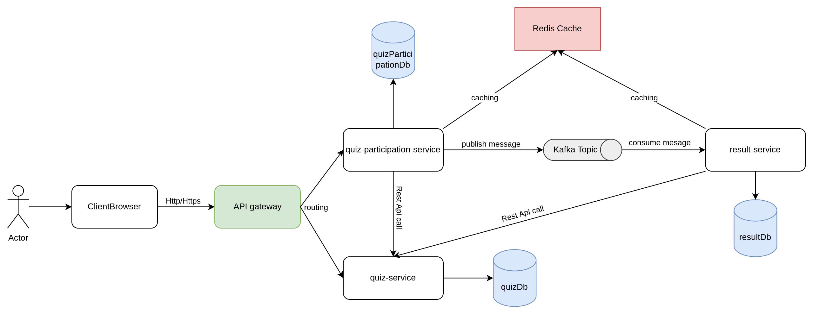

# 📊 Hệ thống Microservices - Phân tích và Thiết kế


## 1. 🎯 Use Case: Tham Gia Bài Thi Trắc Nghiệm Trực Tuyến

### 1.1. Mô Tả Tổng Quan

Hệ thống cho phép sinh viên tham gia các bài thi trắc nghiệm trực tuyến bằng cách sử dụng **Mã Sinh Viên (MSV)** và một **Mã Xác Thực (MXT)** duy nhất cho từng bài thi. Sau khi xác thực thành công và trong khung thời gian cho phép, sinh viên được cung cấp các câu hỏi trắc nghiệm. Hệ thống kiểm soát thời gian làm bài, tự động chấm điểm và lưu trữ kết quả một cách chính xác và an toàn.

---

### 1.2. Tác Nhân Tham Gia (Actor)

- **Sinh viên (Chính):**
  - Truy cập vào hệ thống thi.
  - Nhập thông tin xác thực (MSV, MXT).
  - Làm bài thi và nộp bài.
  - (Tùy chọn) Xem kết quả sau khi chấm điểm.

---

### 1.3. Mục Tiêu Của Use Case

- ✅ Xác thực quyền truy cập bài thi thông qua MSV và MXT.
- ✅ Cung cấp nội dung bài thi một cách đầy đủ và chính xác.
- ✅ Quản lý phiên làm bài, bao gồm thời gian bắt đầu, kết thúc và trạng thái.
- ✅ Ghi nhận chính xác các câu trả lời của sinh viên.
- ✅ Tự động chấm điểm dựa trên đáp án đúng.
- ✅ Lưu trữ kết quả thi an toàn, đảm bảo tính toàn vẹn.
- ✅ (Tùy chọn) Thông báo kết quả đến sinh viên.

---

### 1.4. Luồng Nghiệp Vụ Chính

1. **Truy cập giao diện làm bài:**
  - Sinh viên truy cập vào trang làm bài.
  - Hệ thống hiển thị thông tin cơ bản về bài thi (tên, mô tả, thời lượng...).

2. **Xác thực thông tin:**
  - Sinh viên nhập MSV và MXT.
  - Hệ thống xác minh thông tin:
    - MSV có hợp lệ và nằm trong danh sách được phép thi không?
    - MXT có khớp không?
    - Thời điểm hiện tại có nằm trong khung giờ làm bài không?

3. **Xử lý kết quả xác thực:**
  - ❌ **Không hợp lệ:** Hiển thị thông báo lỗi và từ chối truy cập.
  - ✅ **Hợp lệ:** Tiếp tục sang bước khởi tạo phiên làm bài.

4. **Quản lý phiên làm bài:**
  - Nếu đã có phiên làm bài trước đó:
    - 🔄 **Chưa kết thúc:** Cho phép tiếp tục làm bài.
    - ✅ **Đã nộp hoặc hết hạn:** Hiển thị thông báo không được làm lại.
  - Nếu chưa có phiên:
    - Tạo phiên mới, ghi nhận thời gian bắt đầu và thời gian kết thúc dự kiến.

5. **Tải câu hỏi thi:**
  - Hệ thống lấy danh sách câu hỏi và các lựa chọn từ ngân hàng đề thi.
  - Hiển thị câu hỏi và bắt đầu tính giờ làm bài.

6. **Sinh viên làm bài:**
  - Chọn đáp án cho từng câu hỏi.
  - Hệ thống có thể lưu tạm thời câu trả lời định kỳ hoặc theo sự kiện (chuyển câu, lưu tay...).

7. **Nộp bài:**
  - Sinh viên có thể chủ động nhấn "Nộp bài".
  - Nếu hết giờ, hệ thống tự động nộp bài.

8. **Kiểm tra thời gian và xác thực nộp bài:**
  - Nếu thời điểm nộp hợp lệ → tiếp nhận bài làm.
  - Nếu quá thời gian nộp bài -> từ chối nộp bài.

9. **Chấm điểm:**
  - Hệ thống truy vấn đáp án đúng.
  - So sánh và tính điểm tự động.

10. **Lưu trữ kết quả:**
  - Lưu thông tin: MSV, mã bài thi, thời gian nộp, điểm số, câu trả lời chi tiết.


---

### 1.5. Các Dữ Liệu Chính Được Xử Lý

| Loại dữ liệu         | Mô tả chi tiết |
|----------------------|----------------|
| **Thông tin bài thi** | Tên, mô tả, thời lượng, thời gian truy cập hợp lệ |
| **Câu hỏi**          | Danh sách câu hỏi, lựa chọn, đáp án đúng |
| **Quyền truy cập**   | Danh sách MSV được phép thi, MXT tương ứng, khung giờ hợp lệ |
| **Phiên làm bài**    | Thời gian bắt đầu/kết thúc, trạng thái, câu trả lời tạm thời |
| **Bài làm đã nộp**   | Câu trả lời cuối cùng của sinh viên |
| **Kết quả**          | Điểm số, thời gian nộp bài, chi tiết câu trả lời |

---

## 2. 🧩 Phân tích và xác định các Microservices

Dựa trên luồng nghiệp vụ của use case, hệ thống được phân tách thành các microservices độc lập. Mỗi service đảm nhận một nhóm chức năng nghiệp vụ riêng biệt, giúp hệ thống dễ bảo trì, mở rộng và phát triển linh hoạt hơn theo hướng kiến trúc microservices. Các microservice được xác định trong hệ thống bao gồm: 

---

### 2.1 `api-gateway`

### 🎯 Mô tả
Là điểm vào duy nhất (entry point) cho toàn bộ yêu cầu từ phía client. Đóng vai trò cổng điều phối, định tuyến request đến các microservice tương ứng.

### ✅ Nhiệm vụ chính
- Nhận và xử lý tất cả request phía client.
- Định tuyến request đến các service tương ứng.
- (Tùy chọn) Áp dụng các chính sách bảo mật & tối ưu như:
  - Rate limiting
  - Logging
  - Authentication token parsing

---

## 2.2 `quiz-service`

### 🎯 Mô tả
Chịu trách nhiệm quản lý toàn bộ thông tin bài thi, câu hỏi, đáp án và quyền truy cập của sinh viên.

### ✅ Trách nhiệm chính
- Quản lý thông tin của bài thi (tên, mô tả, thời gian làm bài,...).
- Lưu trữ danh sách câu hỏi và đáp án của bài thi.
- Quản lý quyền truy cập bài thi (`QuizAccess`):
  - Xác định sinh viên được phép tham gia.
  - Quản lý mã truy cập làm bài (access code).
  - Kiểm tra khung thời gian làm bài.

- Cung cấp API cho các service khác:
  - Truy vấn thông tin và câu hỏi bài thi (không bao gồm đáp án).
  - Truy vấn đáp án đúng để phục vụ chấm điểm.
  - Xác thực access code.

### 🗂️ Dữ liệu quản lý
- `Quiz Info`
- `Questions & Corect Answers`
- `Quiz Access ` (student ID, access code, valid from, valid until)


---

## 2.3 `quiz-participation-service`

### 🎯 Mô tả
Xử lý nghiệp vụ chính của việc sinh viên **tham gia và thực hiện bài thi**, từ lúc bắt đầu đến khi nộp bài.

### ✅ Trách nhiệm chính
- Xác thực quyền truy cập với `quiz-service`.
- Kiểm tra khung thời gian hợp lệ.
- Khởi tạo phiên làm bài (quiz session) cho sinh viên:
  - Lưu thông tin thời gian bắt đầu, trạng thái làm bài,...
- Truy xuất câu hỏi từ `quiz-service`.
- Xử lý yêu cầu nộp bài và gửi thông tin nộp bài của sinh viên đến `result-service`.

### 🗂️ Dữ liệu quản lý
- `Quiz Session` (student ID, quiz ID, start time, end time, trạng thái, danh sách câu trả lời)
- Trạng thái và nội dung làm bài theo thời gian thực

---

## 2.4 `result-service`

### 🎯 Mô tả
Chịu trách nhiệm chấm điểm và lưu trữ kết quả cuối cùng của bài thi.

### ✅ Trách nhiệm chính
- Nhận dữ liệu bài làm từ `quiz-participation-service`.
- Lấy đáp án đúng từ `quiz-service`.
- So sánh câu trả lời và tính điểm.
- Lưu kết quả bài thi, bao gồm:
  - Thông tin sinh viên, mã bài thi
  - Điểm số
  - Thời gian nộp
  - Danh sách câu trả lời đã nộp
- Cung cấp API tra cứu kết quả.

### 🗂️ Dữ liệu quản lý
- `Quiz Result`: student ID, quiz ID, submission time, score, submitted answers

## 3. 🔄 Giao Tiếp Giữa Các Dịch Vụ (Service Communication)

Hệ thống thi trắc nghiệm trực tuyến được tổ chức theo kiến trúc microservices, trong đó các dịch vụ giao tiếp với nhau bằng hai hình thức chính: **đồng bộ (REST)** và **bất đồng bộ (Kafka)**, tùy thuộc vào yêu cầu về thời gian phản hồi và độ tách biệt giữa các tiến trình xử lý.

---

### 3.1. Giao Tiếp Giữa Client và Hệ Thống

- **Client ⇄ API Gateway (REST qua HTTPS):**
  - Giao tiếp giữa người dùng cuối (trình duyệt, ứng dụng) và hệ thống được thực hiện qua API Gateway.

  - Gateway đóng vai trò kiểm soát truy cập, xác thực, ghi log, và định tuyến yêu cầu tới các microservice phù hợp trong nội bộ hệ thống.

---

### 3.2. Giao Tiếp Đồng Bộ Giữa Các Dịch Vụ (Synchronous - REST API)

#### ✅ Ưu điểm:
- Phản hồi tức thời.
- Dễ kiểm soát luồng xử lý nghiệp vụ.
- Phù hợp cho các tác vụ cần dữ liệu chính xác ngay thời điểm xử lý.

#### 🔄 Các mối quan hệ REST chính:

| Service nguồn               | Service đích  | Mục đích |
|-----------------------------|---------------|----------|
| `Quiz Participation Service` | `Quiz Service` | Xác thực mã truy cập (MXT), lấy thông tin bài thi và câu hỏi. |
| `Result Service`            | `Quiz Service` | Truy xuất đáp án đúng của bài thi để phục vụ chấm điểm. |

> **Phân tích:**  
Các service này cần dữ liệu ngay lập tức để tiếp tục xử lý logic quan trọng trong luồng nghiêp vụ. Ví dụ, khi sinh viên nhập mã xác thực, hệ thống phải kiểm tra tính hợp lệ ngay để quyết định có cho phép bắt đầu làm bài hay không.

Vấn đề Dual Write: 

---

### 3.3. Giao Tiếp Bất Đồng Bộ Giữa Các Dịch Vụ (Asynchronous - Kafka)

#### ✅ Ưu điểm:
- Tăng khả năng mở rộng, giảm độ phụ thuộc giữa các dịch vụ.
- Hỗ trợ xử lý khối lượng lớn dữ liệu mà không gây nghẽn hệ thống.
- Dễ dàng mở rộng thêm các consumer khác trong tương lai mà không cần thay đổi producer.

#### 📬 Giao tiếp bất đồng bộ giữa các dịch vụ được thực hiện thông qua Kafka, với các producer và consumer như sau:

| Producer | Kafka Topic | Consumer | Mục đích |
|----------|-------------|----------|----------|
| `Quiz Participation Service` | `quiz_submissions` | `Result Service` | Gửi bài làm đã nộp để xử lý chấm điểm (batch hoặc real-time). |

> **Phân tích:**  
Sau khi sinh viên nộp bài, `Quiz Participation Service` gửi dữ liệu bài làm qua Kafka. `Result Service` tiêu thụ dữ liệu này để thực hiện chấm điểm – tách biệt quá trình làm bài và chấm bài giúp hệ thống không bị chậm trong thời gian cao điểm.

---

### 3.4. Xử Lý Tính Nhất Quán Dữ Liệu và Độ Tin Cậy của cơ chế giao tiếp Bất Đồng Bộ trong xử lý giao dịch phân tán

Trong hệ thống microservices, việc đảm bảo tính nhất quán dữ liệu và độ tin cậy khi các service tương tác với nhau, đặc biệt qua các cơ chế bất đồng bộ như message broker, là một thách thức quan trọng. Một trong những tình huống điển hình phát sinh trong use case "Tham gia bài thi" là khi `Quiz Participation Service` xử lý việc nộp bài của sinh viên.

#### Vấn đề Dual-Write khi Nộp Bài Thi

Khi một sinh viên nộp bài thi, `Quiz Participation Service` cần thực hiện hai thao tác quan trọng:

1.  **Cập nhật trạng thái cục bộ:** Thay đổi trạng thái của phiên làm bài (Exam Session) trong cơ sở dữ liệu của mình (ví dụ: `ExamSessionDB`) thành `SUBMITTED`. Việc này nhằm mục đích đánh dấu phiên đã hoàn thành và ngăn chặn sinh viên thực hiện các thao tác nộp bài lặp lại trên cùng một phiên.
2.  **Publish sự kiện lên Message Broker:** Gửi một message/event chứa thông tin bài làm đã nộp (ví dụ: `QuizSubmissionEvent`) lên một topic trên Kafka. Message này sẽ được `Result Service` tiêu thụ để tiến hành chấm điểm.

Vấn đề phát sinh là làm thế nào để đảm bảo cả hai thao tác này được thực hiện một cách nguyên tử (atomically) hoặc ít nhất là đảm bảo tính nhất quán cuối cùng (eventual consistency) mà không làm mất dữ liệu.

*   **Rủi ro của việc thực hiện tuần tự đơn giản:**
  *   **Nếu cập nhật CSDL trước, publish message sau:** Nếu CSDL được cập nhật thành công nhưng việc publish message lên Kafka thất bại (ví dụ: Kafka broker không khả dụng, lỗi mạng), bài làm sẽ không bao giờ được gửi đi chấm điểm, dẫn đến mất dữ liệu bài làm của sinh viên mặc dù phiên đã được đánh dấu là đã nộp.
  *   **Nếu publish message trước, cập nhật CSDL sau:** Nếu message được publish thành công nhưng việc cập nhật CSDL thất bại (ví dụ: service bị crash, lỗi kết nối CSDL), `Result Service` có thể nhận và xử lý bài làm, nhưng `Quiz Participation Service` vẫn ghi nhận phiên làm bài ở trạng thái chưa nộp. Điều này có thể dẫn đến việc sinh viên có thể cố gắng nộp lại (nếu giao diện cho phép) hoặc hệ thống có thể xử lý không nhất quán.

Sử dụng Two-Phase Commit (2PC) truyền thống thường không phải là lựa chọn tối ưu trong kiến trúc microservices với message broker do tính phức tạp, khả năng block tài nguyên và giảm tính sẵn sàng của hệ thống.

#### Giải pháp: Outbox Pattern kết hợp với Idempotent Consumer

Để giải quyết vấn đề dual-write và đảm bảo độ tin cậy "at-least-once" cho việc gửi message, đồng thời tránh việc xử lý trùng lặp ở phía consumer, chúng tôi áp dụng **Outbox Pattern** tại `Quiz Participation Service` và xây dựng **Idempotent Consumer** tại `Result Service`.

####  Outbox Pattern được triển khai trong `Quiz Participation Service` như sau: 

**Nguyên tắc hoạt động:**

Thay vì `Quiz Participation Service` trực tiếp cập nhật CSDL của mình và sau đó publish message lên Kafka trong cùng một transaction nghiệp vụ (điều này không thể thực hiện nguyên tử với một CSDL quan hệ và một message broker bên ngoài), chúng ta sẽ thực hiện như sau:

1.  **Transaction Cục bộ Duy nhất:** Khi sinh viên nộp bài, `Quiz Participation Service` sẽ thực hiện một **transaction cục bộ duy nhất** trên `ExamSessionDB` của mình. Transaction này bao gồm hai thao tác:
  *   Cập nhật trạng thái của phiên làm bài (Exam Session) thành `SUBMITTED`.
  *   Ghi một bản ghi (message/event) đại diện cho bài làm đã nộp vào một bảng đặc biệt gọi là **`outbox` table** trong cùng `ExamSessionDB` đó. Bảng `outbox` này có cấu trúc tương tự như message cần gửi đi (ví dụ: `event_id`, `event_type`, `payload`, `status='PENDING'`).
  *   Do cả hai thao tác này đều nằm trong cùng một transaction CSDL, chúng sẽ hoặc cùng thành công, hoặc cùng thất bại, đảm bảo tính nguyên tử.

2.  **Message Relay Process (Tiến trình chuyển tiếp Message):**
  *   Một tiến trình riêng biệt (có thể là một worker, một scheduled job, hoặc sử dụng kỹ thuật Change Data Capture - CDC nếu CSDL hỗ trợ) sẽ theo dõi bảng `outbox`.
  *   Khi phát hiện các message mới với trạng thái `PENDING` trong bảng `outbox`, tiến trình này sẽ đọc chúng và cố gắng publish lên Kafka topic (`quiz_submissions`).
  *   **Nếu publish thành công:** Tiến trình sẽ cập nhật trạng thái của message trong bảng `outbox` thành `PUBLISHED` (hoặc xóa message đó, tùy theo chiến lược).
  *   **Nếu publish thất bại:** Message vẫn ở trạng thái `PENDING` trong bảng `outbox`. Tiến trình Message Relay sẽ thử lại sau đó. Điều này đảm bảo cơ chế "at-least-once delivery" – message sẽ được gửi đi ít nhất một lần.

**Lợi ích của Outbox Pattern:**

*   **Đảm bảo tính nguyên tử:** Việc thay đổi trạng thái nghiệp vụ và việc ghi nhận ý định gửi message được thực hiện nguyên tử trong một transaction CSDL duy nhất.
*   **Không mất message:** Ngay cả khi service bị crash ngay sau khi commit transaction CSDL (trước khi Message Relay kịp xử lý), message vẫn nằm an toàn trong bảng `outbox` và sẽ được gửi đi khi Message Relay hoạt động trở lại.
*   **Tách rời logic nghiệp vụ và logic gửi message:** Service chính không bị block bởi việc gửi message.

#### Idempotent Consumer tại `Result Service` được triển khai như sau:

Do Outbox Pattern đảm bảo "at-least-once delivery", có khả năng `Result Service` sẽ nhận được cùng một message nhiều lần (ví dụ: nếu Message Relay gửi message thành công nhưng không kịp cập nhật trạng thái trong `outbox` trước khi bị lỗi và khởi động lại, nó có thể gửi lại message đó).

Để ngăn chặn việc chấm điểm lại cùng một bài thi nhiều lần, `Result Service` phải được thiết kế như một **Idempotent Consumer**.

**Nguyên tắc hoạt động:**

Một consumer được gọi là idempotent nếu việc xử lý cùng một message nhiều lần đều cho ra kết quả giống như việc xử lý message đó chỉ một lần, và không gây ra tác dụng phụ không mong muốn.
Để đạt được điều này, `Result Service` sẽ thực hiện các như sau:

**Kiểm tra và Theo dõi các Message đã Xử lý:**
  *   Khi `Result Service` nhận được một message, trước khi chấm điểm, cần phải kiếm tra result ứng với sessionId đã được gửi trong message đó đã được xử lý hay chưa.
  *   **Nếu message đã được xử lý:** `Result Service` sẽ chỉ ack message này và không tiếp tục xử lý.
  *   **Nếu message chưa được xử lý:** `Result Service` tiến hành chấm điểm, lưu kết quả, và sau đó ghi nhận `event_id` này là đã xử lý.

**Lợi ích của Idempotent Consumer:**

*   **Đảm bảo tính đúng đắn:** Ngăn chặn việc xử lý trùng lặp dữ liệu và các tác dụng phụ không mong muốn (ví dụ: cộng điểm nhiều lần cho cùng một bài làm).
*   **Tăng khả năng chịu lỗi:** Hệ thống có thể an toàn xử lý lại các message khi cần thiết mà không làm hỏng dữ liệu.

## 4. 🗂️ Thiết kế Dữ liệu (Data Design)

Dưới đây là thiết kế dữ liệu chi tiết cho từng microservice:

### `quiz-service`
- **Mô hình dữ liệu:**
  - Bảng `quizzes`:
    - `id` (Primary Key): UUID
    - `title`: String
    - `description`: Text
    - `valid_from`: Timestamp
    - `valid_until`: Timestamp
    - `created_at`: Timestamp
    - `updated_at`: Timestamp
  
  - Bảng `questions`:
    - `id` (Primary Key): UUID
    - `quiz_id` (Foreign Key): UUID
    - `content`: Text
    - `option_a`: String (đáp án A)
    - `option_b`: String (đáp án B) 
    - `option_c`: String (đáp án C)
    - `option_d`: String (đáp án D)
    - `correct_option`: Enum (`A`, `B`, `C`, `D`) (đáp án đúng)
    - `created_at`: Timestamp
    - `updated_at`: Timestamp
  
  - Bảng `quiz_access_codes`:
    - `id` (Primary Key): UUID
    - `quiz_id` (Foreign Key): UUID
    - `student_id` (Foreign Key): String
    - `access_code`: String (unique)
    - `valid_from`: Timestamp
    - `valid_until`: Timestamp
    - `created_at`: Timestamp
    - `updated_at`: Timestamp

### `quiz-participation-service`
- **Mô hình dữ liệu:**
  - Bảng `exam_sessions`:
    - `id` (Primary Key): UUID
    - `student_id` (Foreign Key): String
    - `quiz_id` (Foreign Key): UUID
    - `start_time`: Timestamp
    - `end_time`: Timestamp
    - `status`: Enum (`STARTED`, `SUBMITTED`, `CANCELLED`)
    - `created_at`: Timestamp
    - `updated_at`: Timestamp

### `result-service`
- **Mô hình dữ liệu (MongoDB):**
  - Collection `results`:
    - `_id`: ObjectId (tự động tạo bởi MongoDB)
    - `exam_session_id`: String (UUID của phiên thi)
    - `student_id`: String (UUID của sinh viên)
    - `quiz_id`: String (UUID của bài thi)
    - `score`: Double (điểm tổng)
    - `total_question`: Int (Số lượng câu hỏi)
    - `scoring_details`: Array (chi tiết điểm từng câu hỏi)
      - `question_id`: String
      - `selected_option`: String (A, B, C, D)
      - `correct_option`: String (A, B, C, D)
      - `is_correct`: Boolean
      - `score`: Double (điểm cho câu hỏi)
    - `submission_time`: Date (thời điểm nộp bài)
    - `status`: String (GRADED, ERROR)
    - `metadata`: Object (dữ liệu bổ sung nếu có)
    - `created_at`: Date

### `kafka message payload` 

#### Topic: `quiz_submissions`
Message này được gửi từ `quiz-participation-service` đến `result-service` khi sinh viên nộp bài thi.

```json
{
  "messageId": "131a4851-00ba-4367-b24b-ebb0c1eb2a99",
  "timestamp": "2025-05-13T13:26:30.682020569",
  "eventType": "QUIZ_SUBMISSION_CREATED",
  "payload": {
    "examSessionId": "9c8f016f-6e2e-4728-833d-552788fdeed7",
    "startTime": "2025-05-13T13:16:32.913172",
    "endTime": "2025-05-13T16:36:32.913172",
    "studentId": "B21DCCN435",
    "quizId": "6091cf92-d467-43cb-9668-49861f112156",
    "submissionTime": "2025-05-13T13:26:30.677741529",
    "answers": [
      {
        "questionId": "6091cf92-d467-43cb-9668-49861f112222",
        "studentAnswer": "A"
      },
      {
        "questionId": "6091cf92-d467-43cb-9668-49861f112223",
        "studentAnswer": "A"
      }
    ],
    "metadata": {
      "clientIp": "127.0.0.1",
      "userAgent": "ExamClient/1.0"
    }
  }
}
```

## 5. 📦 Kế hoạch Triển khai (Deployment Plan)

Kế hoạch triển khai hệ thống thi trắc nghiệm online được thiết kế để đảm bảo tính linh hoạt, khả năng mở rộng và quản lý hiệu quả. Quá trình triển khai tận dụng công nghệ container hóa với Docker và có thể mở rộng lên các nền tảng điều phối container như Kubernetes cho môi trường production quy mô lớn.

### 5.1 Đóng gói Ứng dụng thành Docker Image

Mỗi microservice (Backend Services) và một số thành phần Frontend (nếu được phục vụ qua server riêng) sẽ được đóng gói thành một Docker image riêng biệt.

#### Quy trình

1. **Tạo `Dockerfile` cho mỗi service:**
  - Mỗi service có một tệp `Dockerfile` định nghĩa các bước xây dựng image.
  - **Base Image:** Chọn base image phù hợp với ngôn ngữ và framework (ví dụ: `openjdk:17-slim` cho Java Spring Boot, `node:18-alpine` cho Node.js, `nginx:stable-alpine` cho frontend tĩnh hoặc API Gateway).
  - **Sao chép mã nguồn/artifact:** Sao chép mã nguồn đã biên dịch (ví dụ: `.jar` cho Java, thư mục `build` cho React) vào image.
  - **Cài đặt phụ thuộc:** Cài đặt thư viện hoặc công cụ cần thiết trong quá trình xây dựng hoặc khi container chạy.
  - **Thiết lập biến môi trường:** Khai báo biến môi trường mặc định (có thể ghi đè khi chạy container).
  - **Mở cổng (Expose Port):** Khai báo cổng mà ứng dụng lắng nghe (ví dụ: `EXPOSE 8080` cho Spring Boot).
  - **Lệnh khởi chạy (Entrypoint/CMD):** Định nghĩa lệnh thực thi khi container khởi động (ví dụ: `java -jar app.jar`).

2. **Xây dựng (Build) Docker Image:**
  - Sử dụng lệnh `docker build -t <image_name>:<tag> .` trong thư mục chứa `Dockerfile` để tạo image.
  - Ví dụ: `docker build -t quiz-service:latest .`

3. **Đẩy (Push) Image lên Container Registry:**
  - Sau khi xây dựng và kiểm thử local, đẩy image lên container registry (ví dụ: Docker Hub, AWS ECR, Google GCR, GitLab Container Registry).
  - Ví dụ: `docker push myregistry.com/myproject/quiz-service:latest`

#### Lợi ích

- **Tính nhất quán môi trường:** Service chạy giống nhau trên mọi môi trường (development, staging, production) vì phụ thuộc được đóng gói.
- **Tính di động:** Image chạy trên bất kỳ máy nào có Docker Engine.
- **Cô lập:** Mỗi service chạy trong container riêng, tránh xung đột phụ thuộc.

### 5.2 Triển khai bằng Docker Compose 

Docker Compose là công cụ phù hợp để định nghĩa và chạy ứng dụng Docker đa container trên một máy chủ duy nhất, thường dùng cho môi trường phát triển và kiểm thử quy mô nhỏ.

#### Quy trình

1. **Tạo tệp `docker-compose.yml`:**
  - Tệp định nghĩa tất cả service (microservice, API Gateway, Kafka, Redis, MySQL, MongoDB).
  - **Khai báo services:** Mỗi service (`quiz-service`, `api-gateway`, `kafka`, `redis`, `mysql-quizdb`) được định nghĩa trong `docker-compose.yml`.
    - `image`: Chỉ định image Docker (từ local build hoặc registry).
    - `ports`: Ánh xạ cổng từ container ra host (ví dụ: `- "8080:8080"`).
    - `environment`: Khai báo biến môi trường (ví dụ: URL database, Kafka broker, secret keys), có thể lấy từ tệp `.env`.
    - `volumes`: Gắn volume để lưu trữ dữ liệu lâu dài cho stateful service (MySQL, MongoDB, Kafka).
      - Ví dụ cho MySQL: `volumes: - mysql_quizdb_data:/var/lib/mysql`
    - `networks`: Định nghĩa mạng nội bộ để các container giao tiếp bằng tên service.
    - `depends_on`: Xác định thứ tự khởi tạo và phụ thuộc (ví dụ: `quiz-service` khởi động sau `mysql-quizdb`).

2. **Khởi chạy ứng dụng:**
  - Sử dụng lệnh `docker-compose up -d` để chạy tất cả service ở chế độ detached.

3. **Quản lý ứng dụng:**
  - `docker-compose ps`: Xem trạng thái container.
  - `docker-compose logs <service_name>`: Xem log của service.
  - `docker-compose down`: Dừng và xóa container, network, volume (tùy chọn).

#### Lợi ích

- **Đơn giản hóa thiết lập môi trường:** Khởi chạy hệ thống với một lệnh.
- **Mô phỏng môi trường đa service:** Hỗ trợ phát triển và kiểm thử tương tác giữa các service.
- **Quản lý cấu hình tập trung:** Cấu hình dịch vụ nằm trong `docker-compose.yml`.

### 5.3 Triển khai trên Kubernetes 

Kubernetes (K8s) là nền tảng điều phối container mã nguồn mở, tự động hóa triển khai, scaling, và quản lý ứng dụng container hóa. Đây là lựa chọn ưu tiên cho môi trường production nhờ khả năng chịu lỗi, tự phục hồi và quản lý tài nguyên hiệu quả.

#### Quy trình

1. **Chuẩn bị tệp Manifest YAML của Kubernetes:**
  - Mỗi thành phần (microservice, database, message broker) được định nghĩa bằng tệp YAML.
  - **`Namespace`**: Tạo `Namespace` riêng (ví dụ: `quiz-app`) để cách ly tài nguyên.
    ```yaml
    apiVersion: v1
    kind: Namespace
    metadata:
      name: quiz-app
    ```
  - **`Deployment`**: Quản lý triển khai và cập nhật `Pod`.
    - Khai báo `replicas` (số lượng instance).
    - Định nghĩa `template` cho `Pod` (image, ports, biến môi trường, resource limits, probes).
  - **`Service` (ClusterIP)**: Tạo điểm truy cập nội bộ (IP/DNS) cho microservice.
    ```yaml
    apiVersion: v1
    kind: Service
    metadata:
      name: api-gateway
      namespace: ptit-quiz-app
    spec:
      selector:
        app: quiz-service
      ports:
        - protocol: TCP
          port: 80
          targetPort: 80
      type: ClusterIP
    ```
  - **`Ingress` (với Nginx Ingress Controller)**: Expose `api-gateway` ra ngoài cluster.
    ```yaml
    apiVersion: networking.k8s.io/v1
    kind: Ingress
    metadata:
      name: api-gateway-ingress
      namespace: ptit-quiz-app
      annotations:
        nginx.ingress.kubernetes.io/rewrite-target: /
    spec:
      rules:
        - host: quizapp.ptit.local
          http:
            paths:
              - path: /api
                pathType: Prefix
                backend:
                  service:
                    name: api-gateway
                    port:
                      number: 80
    ```
    

  - **`ConfigMap` và `Secret`**: Quản lý cấu hình và thông tin nhạy cảm.
  - **`PersistentVolume` (PV) và `PersistentVolumeClaim` (PVC)**: Quản lý lưu trữ cho stateful service.
 
2. **Áp dụng Manifest vào Cluster Kubernetes:**
  - Sử dụng `kubectl apply -f <directory_or_file_name> -n quiz-app` để triển khai/cập nhật tài nguyên.

3. **Quản lý và Giám sát:**
  - Sử dụng `kubectl` để kiểm tra trạng thái, log, v.v.
  - Tích hợp công cụ giám sát (Prometheus, Grafana) và logging (ELK Stack, Loki).

#### Lợi ích

- **Khả năng mở rộng tự động (Autoscaling):** Tăng/giảm `Pod` dựa trên tải (CPU/memory) qua Horizontal Pod Autoscaler (HPA).
- **Tự phục hồi (Self-healing):** Tự động khởi động lại/thay thế `Pod` bị lỗi.
- **Cập nhật và rollback không gián đoạn:** Hỗ trợ rolling updates và rollbacks.
- **Khám phá dịch vụ và cân bằng tải:** Cơ chế khám phá dịch vụ nội bộ và load balancing.
- **Quản lý tài nguyên hiệu quả.**
## 6. 🎨 Sơ đồ Kiến trúc (Architecture Diagram)


