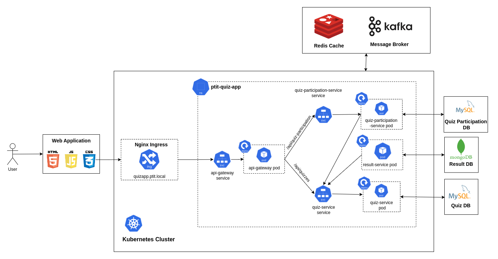
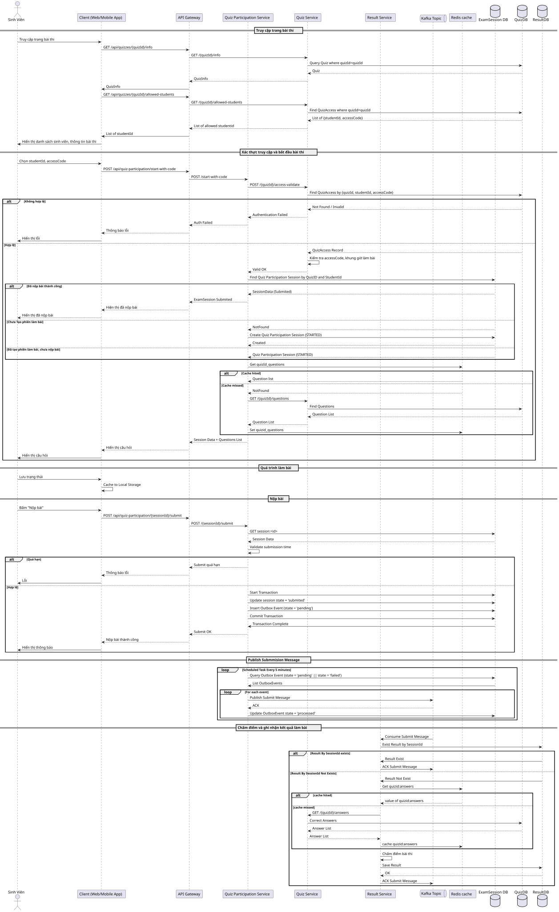

# Kiến trúc Hệ thống

## Tổng quan
Hệ thống này được thiết kế để tổ chức các kỳ thi trắc nghiệm trực tuyến có giới hạn thời gian cho các sinh viên cụ thể. Thay vì hệ thống đăng nhập tập trung, quyền truy cập vào mỗi bài thi được kiểm soát bằng mã xác thực (access code) duy nhất cho từng sinh viên, chỉ hợp lệ trong một khung thời gian định trước.

Hệ thống được xây dựng theo kiến trúc microservices, cho phép:
- Tính mở rộng và linh hoạt cao
- Phân chia trách nhiệm rõ ràng giữa các dịch vụ
- Triển khai độc lập từng thành phần
- Tính sẵn sàng và khả năng chịu lỗi tốt

## Kiến trúc tổng thể

## Các thành phần hệ thống

### Frontend
- **Web/Mobile Client**: Giao diện người dùng cho sinh viên tham gia thi, hiển thị câu hỏi và thu thập câu trả lời. Trạng thái câu trả lời được quản lý ở phía client và chỉ gửi lên server khi nộp bài.

### Backend Services

- **API Gateway**: Điểm vào duy nhất của hệ thống từ client, chịu trách nhiệm định tuyến các request đến microservice thích hợp, xử lý các vấn đề chung như rate limiting và logging cơ bản.

- **Quiz Service**: Quản lý nội dung bài thi, câu hỏi, đáp án, cũng như quản lý quyền truy cập và mã xác thực cho từng sinh viên.

- **Quiz Participation Service**: Xử lý quy trình tham gia thi, từ xác thực sinh viên, gửi câu hỏi, quản lý phiên thi đến việc nhận bài nộp.

- **Result Service**: Xử lý việc chấm điểm bài thi và lưu trữ kết quả chi tiết của sinh viên. Service này sử dụng MongoDB để lưu trữ dữ liệu kết quả linh hoạt.

### Dịch vụ cơ sở hạ tầng

- **Kafka Message Broker**: Hệ thống sử dụng **Apache Kafka** như một nền tảng truyền tải dữ liệu bất đồng bộ giữa các service với thông lượng cao và độ tin cậy lớn.

  - **Tình huống sử dụng chính**:
    - Khi nhiều sinh viên nộp bài cùng lúc → `Quiz Participation Service` gửi bài làm qua Kafka.
    - `Result Service` consume mesage từ kafka để xử lý dữ liệu bài làm của sinh viên và chấm điểm bài thi theo mô hình **event-driven**.

  - **Lợi ích**:
    - Tăng khả năng chịu tải tại thời điểm cao điểm (ví dụ: cuối bài thi).
    - Giảm độ phụ thuộc giữa các service (decoupling).
    - Dễ ràng scale theo chiều ngang.

- **Redis Cache**: Redis được tích hợp như một **in-memory cache** nhằm cải thiện hiệu suất truy vấn dữ liệu tần suất cao, cụ thể:

  - **Caching câu hỏi và đáp án bài thi**:
    - Tại thời điểm bắt đầu bài thi, nhiều sinh viên sẽ đồng thời truy xuất danh sách câu hỏi → việc truy cập Redis giúp giảm tải cho cơ sở dữ liệu.
    - Khi chấm điểm, đáp án đúng cũng có thể được lấy nhanh từ cache thay vì query lại từ DB.

  - **Lợi ích**:
    - Tăng tốc độ phản hồi cho các request truy vấn đề thi.
    - Giảm thiểu độ trễ và tắc nghẽn tại lớp `Quiz Service` khi có tải cao.
    - Giảm số lượng truy vấn trực tiếp đến cơ sở dữ liệu MySQL.

### Cơ sở dữ liệu

- **QuizDB**: Lưu trữ bài thi, câu hỏi, đáp án và thông tin mã truy cập (MySQL).
- **ExamSessionDB**: Lưu trữ thông tin phiên thi (MySQL).
- **ResultDB**: Lưu trữ kết quả thi chi tiết (MongoDB).

## Giao tiếp giữa các service

### Giao tiếp đồng bộ (REST API)
- **Client ⇄ API Gateway**: Giao tiếp qua HTTPS với các endpoint RESTful.
- **API Gateway ⇄ Các Microservice**: Định tuyến các request qua mạng nội bộ.
- **Các Microservice ⇄ Các Microservice**: Một số tương tác cần đồng bộ, ví dụ:
  - Quiz Participation Service ⇄ Quiz Service (xác thực mã truy cập và lấy câu hỏi)
  - Result Service ⇄ Quiz Service (lấy đáp án đúng)
  - Notification Service ⇄ Student Service (lấy thông tin liên lạc)

### Giao tiếp bất đồng bộ (Kafka)
- **Quiz Participation Service → Kafka → Result Service**: Gửi dữ liệu bài làm để chấm điểm
- **Result Service → Kafka → Notification Service**: Yêu cầu gửi thông báo kết quả

## Luồng dữ liệu

## Khả năng mở rộng, khả năng chịu lỗi và tính tin cậy của hệ thống

### 1. Khả năng mở rộng (Scalability)

Hệ thống được thiết kế theo kiến trúc microservices, triển khai trên nền tảng Kubernetes để đảm bảo khả năng mở rộng linh hoạt và tối ưu tài nguyên:

- **Triển khai trên Kubernetes**:
  - Mỗi microservice được container hóa và triển khai dưới dạng Pod, quản lý bởi Deployment .
- **Tách biệt theo domain**:
  - Các microservice được chia theo chức năng độc lập (quiz, participation, result...), hỗ trợ scale từng phần riêng biệt theo nhu cầu thực tế.
- **Redis Cache**:
  - Giúp giảm tải cơ sở dữ liệu tại thời điểm nhiều sinh viên đồng thời truy cập vào bài thi. Redis hoạt động như lớp cache trung gian để phân phối câu hỏi một cách nhanh chóng.
- **Kafka Message Broker**:
  - Cho phép scale các consumer để xử lý đồng thời hàng nghìn sự kiện nộp bài, đặc biệt trong giai đoạn kết thúc kỳ thi.
- **Persistent Volume cho Database và Kafka**:
  - Sử dụng các PersistentVolumeClaim (PVC) để đảm bảo tính bền vững của dữ liệu trên MongoDB, MySQL và Kafka logs.

---

### 2. Khả năng chịu lỗi (Fault Tolerance)

Triển khai trên Kubernetes giúp hệ thống tự phục hồi khi gặp sự cố, kết hợp với các cơ chế chịu lỗi ở tầng ứng dụng:

- **Kubernetes Self-healing**:
  - Khi một Pod gặp lỗi hoặc node chết, Kubernetes sẽ tự động tạo lại Pod thay thế, đảm bảo dịch vụ luôn sẵn sàng.
- **Kafka với replication và retention**:
  - Kafka cluster sử dụng cấu hình replication ≥ 2 để đảm bảo không mất dữ liệu message ngay cả khi một broker gặp sự cố.
  - Kafka consumer có thể khôi phục việc xử lý từ offset đã lưu trước đó.
- **Redis (optional cache)**:
  - Redis chỉ dùng để tăng tốc truy vấn, nếu Redis gặp lỗi, hệ thống tự động fallback truy vấn trực tiếp từ cơ sở dữ liệu.

---

### 3. Tính tin cậy (Reliability)

Để đảm bảo độ chính xác và toàn vẹn dữ liệu, hệ thống sử dụng các kỹ thuật đáng tin cậy ở cả tầng giao tiếp bất đồng bộ lẫn lưu trữ:

- **Outbox Pattern tại `quiz-participation-service`**:
  - Khi sinh viên nộp bài, dữ liệu được ghi vào cơ sở dữ liệu trước (transactional), sau đó lưu vào bảng `outbox`.
  - Một background process (hoặc sidecar container) đảm nhiệm việc publish dữ liệu từ bảng `outbox` lên Kafka.
  - Đảm bảo không có tình trạng “double write inconsistency” khi một trong hai thao tác (ghi DB và gửi Kafka) thất bại.
- **Idempotent Consumer tại `result-service`**:
  - Consumer Kafka được thiết kế idempotent, tránh xử lý trùng lặp .
- **Message Retry )**:
  - Các message lỗi được cấu hình tự động retry.
---

Thông qua việc kết hợp giữa kiến trúc microservices, Redis, Kafka, Outbox Pattern, Idempotent Consumer và triển khai trên Kubernetes, hệ thống đảm bảo:

- Dễ dàng mở rộng khi số lượng sinh viên tăng cao
- Không mất dữ liệu ngay cả trong trường hợp lỗi dịch vụ hoặc message lặp
- Phục hồi nhanh chóng khi gặp sự cố hạ tầng hoặc lỗi logic nội tại

---

