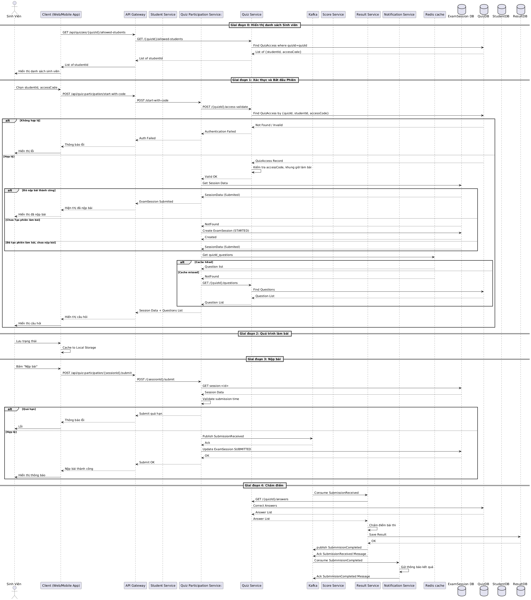

# Kiến trúc Hệ thống

## Tổng quan
Hệ thống này được thiết kế để tổ chức các kỳ thi trắc nghiệm trực tuyến có giới hạn thời gian cho các sinh viên cụ thể. Thay vì hệ thống đăng nhập tập trung, quyền truy cập vào mỗi bài thi được kiểm soát bằng mã xác thực (access code) duy nhất cho từng sinh viên, chỉ hợp lệ trong một khung thời gian định trước.

Hệ thống được xây dựng theo kiến trúc microservices, cho phép:
- Tính mở rộng và linh hoạt cao
- Phân chia trách nhiệm rõ ràng giữa các dịch vụ
- Triển khai độc lập từng thành phần
- Tính sẵn sàng và khả năng chịu lỗi tốt

## Các thành phần hệ thống

### Frontend
- **Web/Mobile Client**: Giao diện người dùng cho sinh viên tham gia thi, hiển thị câu hỏi và thu thập câu trả lời. Trạng thái câu trả lời được quản lý ở phía client và chỉ gửi lên server khi nộp bài.

### Backend Services

- **API Gateway**: Điểm vào duy nhất của hệ thống từ client, chịu trách nhiệm định tuyến các request đến microservice thích hợp, xử lý các vấn đề chung như rate limiting và logging cơ bản.

- **Student Service**: Quản lý thông tin cơ bản của sinh viên (ID, tên, thông tin liên hệ).

- **Quiz Service**: Quản lý nội dung bài thi, câu hỏi, đáp án, cũng như quản lý quyền truy cập và mã xác thực cho từng sinh viên.

- **Quiz Participation Service**: Xử lý quy trình tham gia thi, từ xác thực sinh viên, gửi câu hỏi, quản lý phiên thi đến việc nhận bài nộp.

- **Result Service**: Xử lý việc chấm điểm bài thi và lưu trữ kết quả chi tiết của sinh viên. Service này sử dụng MongoDB để lưu trữ dữ liệu kết quả linh hoạt.

- **Notification Service**: Gửi thông báo kết quả thi cho sinh viên qua email hoặc các phương tiện khác.

### Dịch vụ cơ sở hạ tầng

- **Kafka Message Broker**: Hệ thống messaging phân tán sử dụng để giao tiếp bất đồng bộ giữa các service. Kafka đảm bảo độ tin cậy cao và khả năng xử lý message với thông lượng lớn. Được sử dụng trong hệ thống để:
  - Truyền dữ liệu bài làm từ Quiz Participation Service đến Result Service
  - Gửi thông báo kết quả từ Result Service đến Notification Service
  - Hỗ trợ mô hình event-driven giữa các service

- **Redis Cache**: Hệ thống cache in-memory tốc độ cao được sử dụng để lưu trữ tạm thời dữ liệu câu hỏi bài thi. Redis giúp:
  - Giảm tải cho database chính bằng cách cache danh sách câu hỏi thường xuyên truy vấn
  - Tăng tốc việc lấy dữ liệu câu hỏi khi nhiều sinh viên bắt đầu làm bài thi cùng lúc
  - Cải thiện thời gian phản hồi của hệ thống

### Cơ sở dữ liệu

- **StudentDB**: Lưu trữ thông tin sinh viên (MySQL).
- **QuizDB**: Lưu trữ bài thi, câu hỏi, đáp án và thông tin mã truy cập (MySQL).
- **ExamSessionDB**: Lưu trữ thông tin phiên thi (MySQL).
- **ResultDB**: Lưu trữ kết quả thi chi tiết (MongoDB).

## Giao tiếp giữa các service

### Giao tiếp đồng bộ (REST API)
- **Client ⇄ API Gateway**: Giao tiếp qua HTTPS với các endpoint RESTful.
- **API Gateway ⇄ Các Microservice**: Định tuyến các request qua mạng nội bộ.
- **Các Microservice ⇄ Các Microservice**: Một số tương tác cần đồng bộ, ví dụ:
  - Quiz Participation Service ⇄ Quiz Service (xác thực mã truy cập và lấy câu hỏi)
  - Result Service ⇄ Quiz Service (lấy đáp án đúng)
  - Notification Service ⇄ Student Service (lấy thông tin liên lạc)

### Giao tiếp bất đồng bộ (Kafka)
- **Quiz Participation Service → Kafka → Result Service**: Gửi dữ liệu bài làm để chấm điểm
- **Result Service → Kafka → Notification Service**: Yêu cầu gửi thông báo kết quả

## Luồng dữ liệu

Luồng dữ liệu chính trong hệ thống bao gồm 5 giai đoạn:

### Giai đoạn 0: Hiển thị danh sách sinh viên được phép tham gia
- Client yêu cầu danh sách sinh viên được phép tham gia bài thi cụ thể
- Quiz Service truy vấn QuizDB để tìm các mã truy cập hợp lệ và trả về danh sách sinh viên

### Giai đoạn 1: Xác thực và bắt đầu phiên thi
- Sinh viên nhập mã truy cập và ID
- Quiz Participation Service xác thực thông tin với Quiz Service
- Nếu hợp lệ, tạo phiên thi mới và lấy danh sách câu hỏi (có sử dụng cache)
- Trả về danh sách câu hỏi cho client

### Giai đoạn 2: Quá trình làm bài
- Sinh viên làm bài trên client, các câu trả lời được lưu trữ tạm trong localStorage

### Giai đoạn 3: Nộp bài
- Sinh viên gửi toàn bộ bài làm đến Quiz Participation Service
- Quiz Participation Service xác thực thời gian nộp bài
- Nếu hợp lệ, cập nhật trạng thái phiên thi và gửi bài làm đến Kafka

### Giai đoạn 4: Chấm điểm
- Result Service nhận bài làm từ Kafka
- Lấy đáp án đúng từ Quiz Service
- Chấm điểm và lưu kết quả vào ResultDB
- Gửi thông báo đến Notification Service để thông báo kết quả cho sinh viên

## Khả năng mở rộng và khả năng chịu lỗi

### Khả năng mở rộng
- Các microservice có thể được triển khai độc lập và mở rộng theo nhu cầu
- Kafka hỗ trợ xử lý lượng lớn message khi có nhiều thí sinh nộp bài cùng lúc
- Redis cache giúp giảm tải cho việc truy vấn câu hỏi nhiều lần
- Thiết kế cho phép thêm nhiều node cho mỗi service khi cần thiết

### Khả năng chịu lỗi
- Kiến trúc phân tán giúp hệ thống tiếp tục hoạt động ngay cả khi một số service gặp sự cố
- Kafka đảm bảo tin nhắn không bị mất khi xảy ra lỗi tạm thời
- Mô hình lưu trữ phiên thi đảm bảo không mất dữ liệu khi xảy ra sự cố
- Cơ chế retry và circuit breaker có thể được triển khai trong giao tiếp giữa các service

## Vấn đề bảo mật
- Xác thực nghiêm ngặt sự kết hợp của quizId, studentId, accessCode
- Mã truy cập được thiết kế đủ mạnh và chỉ sử dụng được một lần
- Kiểm tra chặt chẽ khung thời gian làm bài
- Đảm bảo an toàn khi cập nhật trạng thái mã truy cập
- Toàn bộ giao tiếp giữa client và API Gateway sử dụng HTTPS

## Triển khai
Hệ thống được thiết kế để triển khai trên các môi trường container hóa:
- Môi trường phát triển: Docker Compose
- Môi trường sản xuất: Kubernetes hoặc Docker Swarm

Chi tiết kế hoạch triển khai được mô tả trong tài liệu [analysis-and-design.md](analysis-and-design.md#kế-hoạch-triển-khai-deployment-plan).